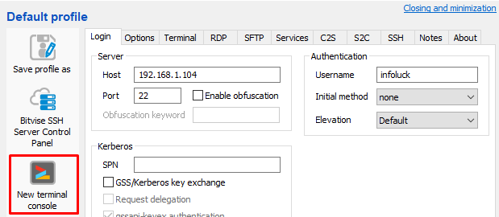
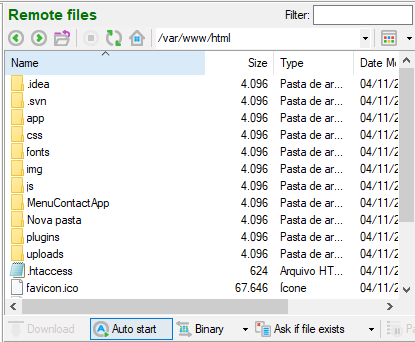

## 📃 Indice
- [Conexão com a Maquina](#-conexão-com-a-máquina)
- [Configuração Bitvise](#---configuração-bitvise)
- [Utilização do Terminal](#---utilização-do-terminal)
- [Ajuste do Timezone](#ajuste-do-timezone-)
- [Desabilitar Firewall](#desabilitar-firewall-)
- [Instalação Apache e PHP](#instalação-apache-e-php-)
- [Configuração do Apache](#configuração-do-apache-)
- [Limpar sujeiras projeto](#limpar-sujeiras-da-cópia-do-projeto-)
- [Instalação do Postgres](#instalação-do-postgres-)
- [Configuração do Postgres](#configuração-do-postgres-)


***

## 🖥 Conexão com a Máquina

Para realizar a conexão com a máquina é necessário primeiramente realizar a instalação do [Bitvise SSH Client](https://www.bitvise.com/ssh-client-download).

Já com o Bitvise instalado faremos o Log in na máquina:

## **🔨 - Configuração Bitvise**

### - Aba Login

#### Server
- Host = 192.168.1.104
- Port = 22

#### Authentication
- Username = infoluck
- Initial method = none
- Elevation = Default

**Ao clicar em "Log in" será requisitado o password:**

#### User Authentication
- Username = infoluck
- Method = password
- Password = root

***

## **💻 - Utilização do Terminal**

Para acessar o terminal é precisa clicar em **"New Terminal Console"**, nele faremos todas as configurações e instalações necessárias para a utilização da máquina.
###



### Ajuste do Timezone ⏰

Para ajustar o timezone digite no terminal:
```
sudo dpkg-reconfigure tzdata
```
Agora basta configurar para `America->São-Paulo`.

Para conferir se foi setado o fuso horário correto digite:
```
date
date -u
```
"Date" trará o timezone que foi setado e "date -u" o timezone internacional.

### Desabilitar Firewall ⚙

Para que mais para frente na instalação do postgres e afins não precisemos abrir portas no firewall o desabilitaremos 

```
sudo ufw disable
```
***

### Instalação Apache e PHP 🔑 

Agora podemos iniciar as instalações. Vamos iniciar instalando Apache e PHP7.
Habilitaremos módulos como opcache (aceleração), gd (imagens) e mbstring (unicode).

```
sudo apt-get update
sudo apt-get install apache2 php libapache2-mod-php
sudo apt-get install php-soap php-xml php-curl php-opcache php-gd php-mbstring
```

Em seguida, habilitaremos os módulos do apache:

```
sudo a2dismod mpm_event
sudo a2dismod mpm_worker
sudo a2enmod mpm_prefork
sudo a2enmod rewrite
sudo a2enmod php7.4
```

Instalaremos o PDO:
```
sudo apt install php-pgsql
```

E por fim o Composer:
```
sudo apt update
```
```
sudo apt install php-cli unzip
```
Certifique-se de estar em seu diretório home. Em seguida, baixe o instalador usando o curl:
```
cd ~
curl -sS https://getcomposer.org/installer -o composer-setup.php
```
Em seguida, vamos verificar se o instalador baixado corresponde ao hash SHA-384:
```
HASH=`curl -sS https://composer.github.io/installer.sig`
```
Se você quiser verificar o valor obtido, execute:
```
echo $HASH
```
Agora, execute o código PHP a seguir, para verificar se o script de instalação está seguro para ser executado:
```
php -r "if (hash_file('SHA384', 'composer-setup.php') === '$HASH') { echo 'Installer verified'; } else { echo 'Installer corrupt'; unlink('composer-setup.php'); } echo PHP_EOL;"
```
Você verá o seguinte resultado:
```
Output
Installer verified
```
Se a saída diz `Installer corrupt`,você precisará baixar o script de instalação novamente e verificar se você está usando o hash correto. Em seguida, repita o processo de verificação. Quando você tiver um instalador verificado, você pode continuar.

Para instalar o composer globalmente, use o seguinte comando que baixará e instalará o Composer como um comando disponível em todo o sistema chamado composer, sob `/usr/local/bin`:
```
sudo php composer-setup.php --install-dir=/usr/local/bin --filename=composer
```
Para testar a sua instalação, execute:
```
composer
```
```
Output
   ______
  / ____/___  ____ ___  ____  ____  ________  _____
 / /   / __ \/ __ `__ \/ __ \/ __ \/ ___/ _ \/ ___/
/ /___/ /_/ / / / / / / /_/ / /_/ (__  )  __/ /
\____/\____/_/ /_/ /_/ .___/\____/____/\___/_/
                    /_/
Composer version 1.10.5 2020-04-10 11:44:22

Usage:
  command [options] [arguments]

Options:
  -h, --help                     Display this help message
  -q, --quiet                    Do not output any message
  -V, --version                  Display this application version
      --ansi                     Force ANSI output
      --no-ansi                  Disable ANSI output
  -n, --no-interaction           Do not ask any interactive question
      --profile                  Display timing and memory usage information
      --no-plugins               Whether to disable plugins.
  -d, --working-dir=WORKING-DIR  If specified, use the given directory as working directory.
      --no-cache                 Prevent use of the cache
  -v|vv|vvv, --verbose           Increase the verbosity of messages: 1 for normal output, 2 for more verbose output and 3 for debug
...
```
Isso verifica que o Composer foi instalado com sucesso em seu sistema e está disponível em todo o sistema.

**(Opcional)** É possível ajustar algumas configurações do PHP, como habilitar a exibição de log de erros, aumentar o limite de uso de RAM, o tempo de execução, o tempo de sessão, e definir limites de upload.

```
echo "" >> /etc/php/7.4/apache2/php.ini
echo "error_log = /tmp/php_errors.log" >> /etc/php/7.4/apache2/php.ini
echo "display_errors = On"             >> /etc/php/7.4/apache2/php.ini
echo "memory_limit = 256M"             >> /etc/php/7.4/apache2/php.ini
echo "max_execution_time = 120"        >> /etc/php/7.4/apache2/php.ini
echo "error_reporting = E_ALL"         >> /etc/php/7.4/apache2/php.ini
echo "file_uploads = On"               >> /etc/php/7.4/apache2/php.ini
echo "post_max_size = 100M"            >> /etc/php/7.4/apache2/php.ini
echo "upload_max_filesize = 100M"      >> /etc/php/7.4/apache2/php.ini
echo "session.gc_maxlifetime = 14000"  >> /etc/php/7.4/apache2/php.ini
```

**(Recomendado)** Quando a aplicação entrar em produção, desligue a exibição de erros. Você pode também ser mais tolerante quanto ao nível de erros a ser reportado.
```
echo "display_errors = Off" >> php.ini
echo "error_reporting = E_ALL & ~E_DEPRECATED & ~E_STRICT & ~E_NOTICE" >> php.ini
```

Quando tudo estiver configurado, restarte o apache:
```
service apache2 restart
```
***
### Configuração do Apache ⚙
Primeiro setaremos permissão para modificar a pasta `/var/www/`:
```
sudo groupadd permapache
sudo usermod -a -G permapache www-data
sudo usermod -a -G permapache $USER 
sudo chgrp -R permapache /var/www
sudo chgrp -R permapache /etc/
sudo chmod -R 777 /var/www
sudo chmod 777 /etc/apache2/apache2.conf
``` 
Para subirmos o projeto no localhost deveremos enviar a pasta do projeto em php para dentro da pasta `/var/www/html` usando o SFTP.


Agora acesse o seguinte arquivo `/etc/apache2/apache2.conf`:

Modifique de:
> <Directory /var/www/>
>
>    Options Indexes FollowSymLinks
>    
>    AllowOverride none
>    
>    Require all granted
>    
> </Directory >
> 
Para:
> <Directory /var/www/>
>
>    Options Indexes FollowSymLinks
>    
>    AllowOverride All
>    
>    Require all granted
>    
> </Directory >


### Limpar sujeiras da cópia do projeto 🧹

Acesse o caminho `/var/www/html/app` para instalarmos o composer dentro do projeto:
```
cd /var/www/html/app
composer install
```
Limparemos as sujeiras da cópia do projeto (Execute um comando por vez):
```
cd /var/www/html/app
sudo php artisan route:clear
sudo php artisan view:clear
sudo php artisan route:cache
sudo php artisan clear-compiled
sudo php artisan config:cache
sudo php artisan config:clear
sudo composer dump-autoload
sudo systemctl restart apache2
```
***
### Instalação do Postgres 🛠

Para instalarmos o Postgres13 executaremos os seguintes comandos:
```
sudo sh -c 'echo "deb http://apt.postgresql.org/pub/repos/apt $(lsb_release -cs)-pgdg main" > /etc/apt/sources.list.d/pgdg.list'
wget --quiet -O - https://www.postgresql.org/media/keys/ACCC4CF8.asc | sudo apt-key add -
sudo apt-get update
sudo apt-get -y install postgresql-13
```

### Configuração do Postgres ⚙

Agora editaremos o arquivo `pg_hba.conf` pelo NANO.

Primeiro setaremos permissão para modificar a pasta `/etc/postgresql/13/main/`:
```
sudo groupadd permpostgres
sudo usermod -a -G permpostgres postgres
sudo usermod -a -G permpostgres $USER 
sudo chgrp -R permpostgres /etc/postgresql/13/main/
sudo chmod -R 777 /etc/postgresql/13/main/
``` 

#### ALGUNS COMANDOS DO NANO:
> CTRL + W -> Pesquisar Palavras
>
> ALT + W -> Próxima Palavra
> 
> CTRL + O -> Salvar
> 
> CTRL + X -> Sair 

Digite:

```
 sudo nano /etc/postgresql/13/main/pg_hba.conf
```

### Altere a linha:
> IPv4 local connections:
> host    all             all             127.0.0.1/32            md5
### Para:
> IPv4 local connections:
> host    all             all             0.0.0.0/0            trust

Agora faremos alteração no arquivo `postgresql.conf`.

```
 sudo nano /etc/postgresql/13/main/postgresql.conf
```

### Altere as linhas:
> #listen_addresses = 'localhost'
>
> datestyle = 'iso, mdy' 	
### Respectivamente para:
> listen_addresses = '*'
> 
> datestyle = 'iso, dmy' 	

### Verifique também se a linha de timezone se encontra da seguinte forma:
> timezone = 'America/Sao_Paulo'

Depois de ter configurados os arquivos alteraremos a senha do postgres, execute um comando por vez:

Alterar senha do serviço:
```
sudo passwd postgres
```
Acessar serviço do postgres:
```
sudo -u postgres psql
```
Alterar senha do banco:
```
ALTER USER postgres WITH ENCRYPTED PASSWORD 'wg091514';
```
Reiniciar o serviço do postgres:
```
systemctl restart postgresql
```


